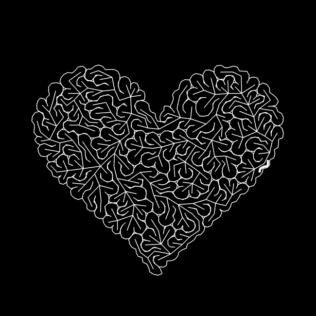

## delaunay-maze-loop

C++ project about making this animation :

### Using :

* CGAL library (not the openFrameworks addon... take care of adding compilation flags)
* openFrameworks

### Algorithm

1) Make a 2D triangulation inside a shape (constrained delaunay triangulation with CGAL)
2) Define the graph of the triangulation
3) Make a tree from the graph (depth/breadth first search for example, but here a priority queue with random weights is used)
4) Rotate around the tree following one side (rotate around vertices and recursively rotate around new vertices if you see an edge of the graph) and build a curve with one new point for each triangle
5) Use an array with cumulative lengths throung the curve and binary search to be able to move through the curve at constant speed (parameter p of the curve from 0 to 1)
6) Draw m particles, particle i being at position of parameter p=1.0*(i+t)/m. t is the time from 0 to 1

Explanation gif :

